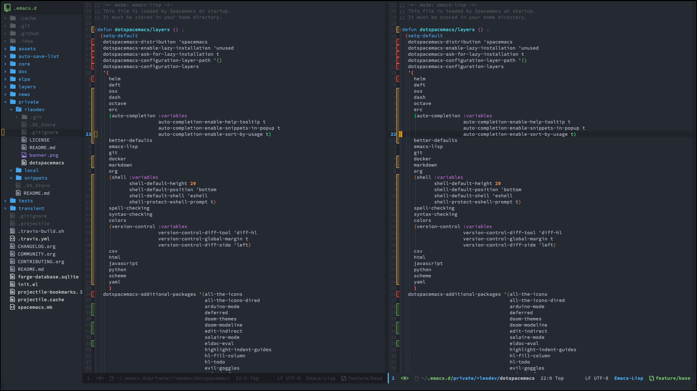

# Doom Spacemacs layer


### Spacemacs layer setup
```shell
# go your home directory, or wherever you want .emacs.d
cd ~

# (optional) move any existing .emacs.d out of the way
mv .emacs.d .emacs.d.BACKUP

git clone https://github.com/syl20bnr/spacemacs.git .emacs.d
cd .emacs.d/private
git clone --recursive git@github.com:aronluigi/spacemacs-layers.git +leodev

cp +leodev/dotspacemacs ~/.spacemacs
# ...edit ~/.spacemacs as necessary, e.g. for ycmd paths, etc...
```


#### OSX system requirements
Install [all-the-icons](https://github.com/domtronn/all-the-icons.el)

```shell
# install emacs
brew tap d12frosted/emacs-plus && brew install emacs-plus --HEAD --with-jansson --with-modern-icon --with-dbus --with-mailutils

# install some more fonts
brew tap homebrew/cask-fonts && brew cask install font-source-code-pro

# Monikube & docker
brew cask install \
     minikube \
     mactex \

# install system tools
brew install \
    coreutils \
    ack \
    direnv \
    node \
    aspell \
    git \
    git-flow \
    haskell-stack \
    ruby \
    go \
    r \
    scala \
    sbt \
    terminal-notifier
    
# NodeJS & JavaScript tools
npm install -g \
    vmd \
    tern \
    js-beautify \
    eslint \
    babel-eslint \
    eslint-plugin-react \
    jshint \
    js-yaml \
    material-design-icons \
    sqlite

# Haskell tools
cabal update
cabal install \
    apply-refact \
    hlint \
    stylish-haskell \
    hasktags \
    hoogle \
    ghc-mod \
    intero

# Python tools
pip install \
    flake8 \
    autoflake \
    hy

# Ruby tools
gem install pry
```

#### GoLang
```shell
go get -u github.com/fatih/gomodifytags
go get -u github.com/nsf/gocode
go get -u github.com/rogpeppe/godef
go get -u golang.org/x/tools/cmd/guru
go get -u golang.org/x/tools/cmd/gorename
go get -u golang.org/x/tools/cmd/goimports
go get -u github.com/alecthomas/gometalinter

gometalinter --install --update
```

#### Scala
https://ensime.github.io/build_tools/sbt/#install

